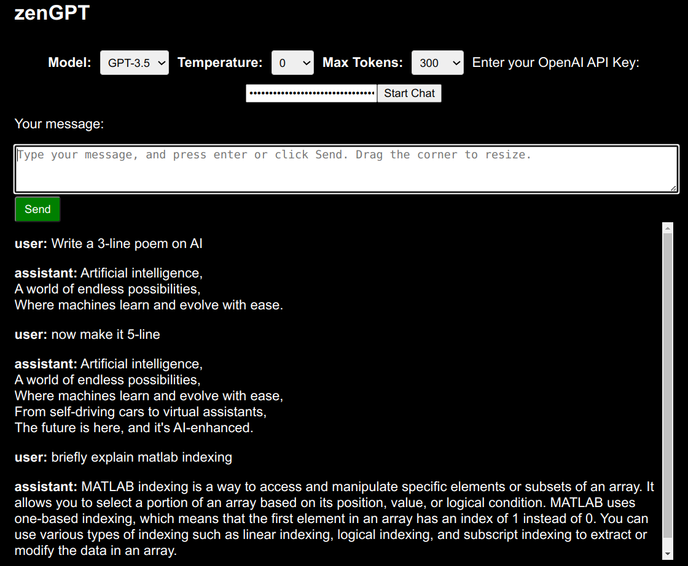

# zenGPT
A lightweight GPT chat website with only 1 file. Set a few parameters, enter your OpenAI API key, and chat.

## How to use
1. Download the zenGPT.html file.
2. Open it in a browser.
3. You may change the model, temperature, or max tokens, or just use the default.
4. Enter your OpenAI API key and click on 'Start Chat'. 
5. The chat area will be shown now. Enter your question in the chat area and click on the 'Send' button or press your 'Enter' key.
5. After chatGPT replies, you can enter another question and click on 'Send'. Different from the [minGPT](https://github.com/eliujl/minGPT) for minimalisticity, in zenGPT, the chat history is utilized.

## Notes
1. The 'Role' of AI is set as 'Assistant'. The code implemented the selection of different roles but GPT-3.5-turbo may not follow the 'Role' as OpenAI describes, so the 'Role' selection is commented out.
2. Not all markdown strings may be fully rendered.

## Preview

**Screenshot when the html file is open**

**Screenshot after the OpenAI API key is entered**

**Screenshot of a chat**

## Conclusion
That's it! Quite simple without fancy functionalities.
